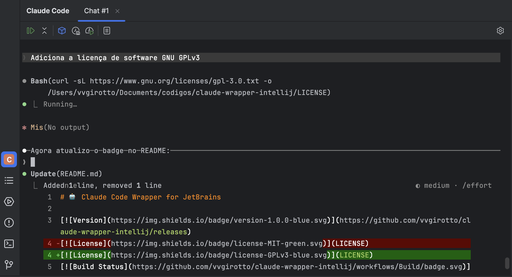
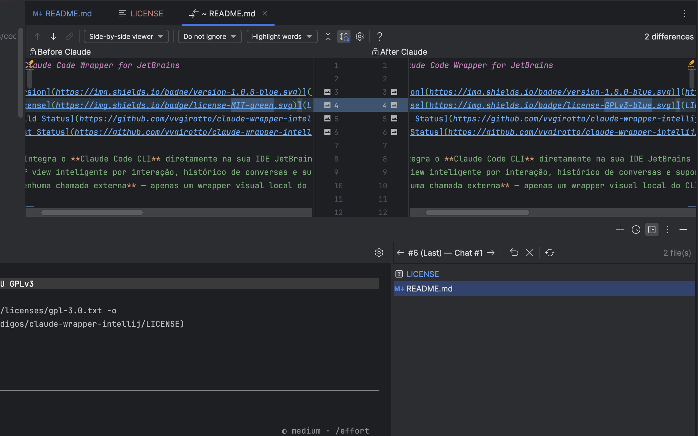
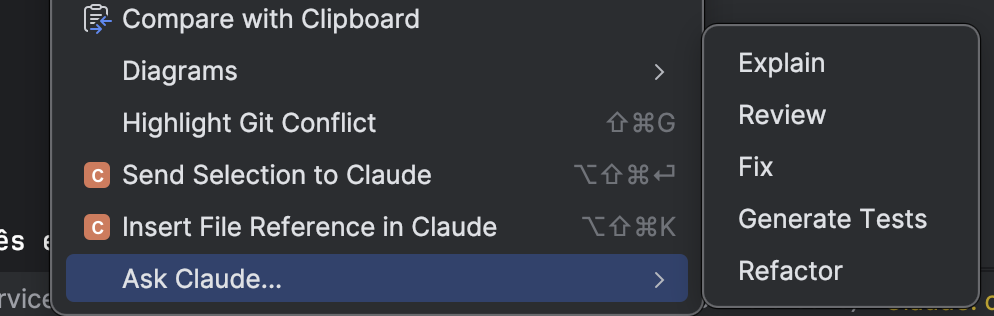
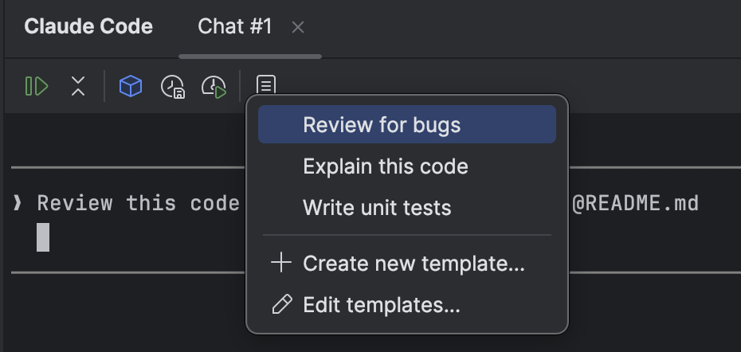
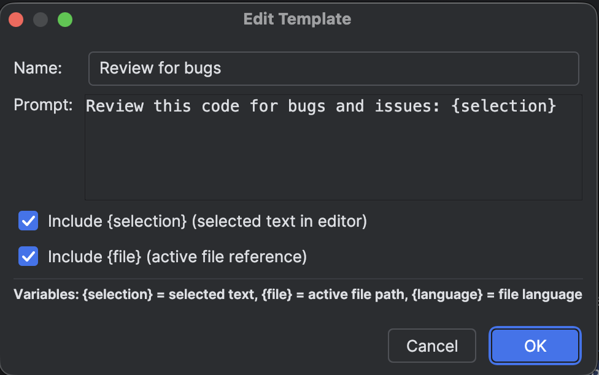
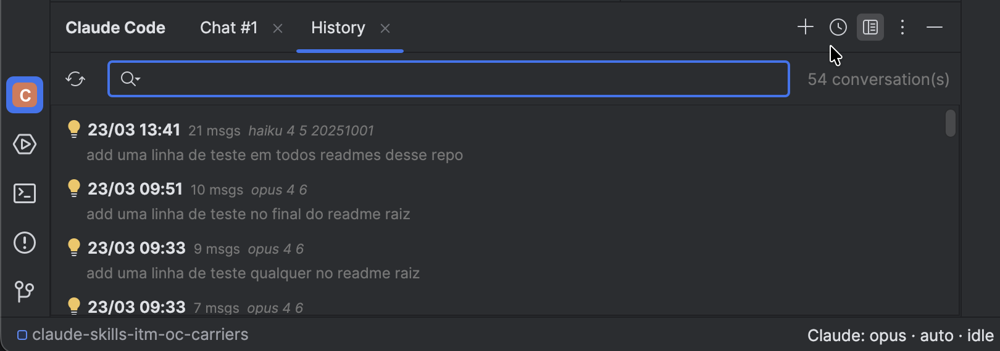
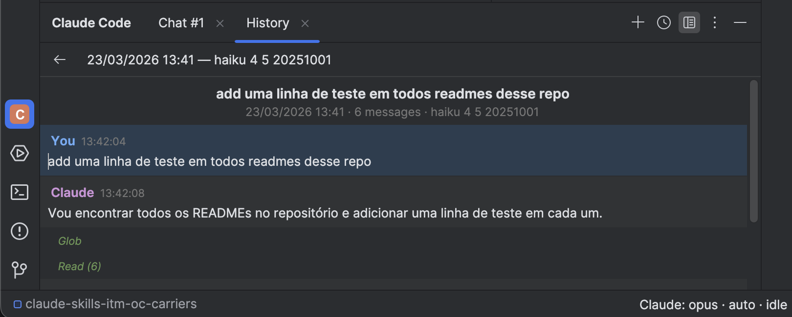
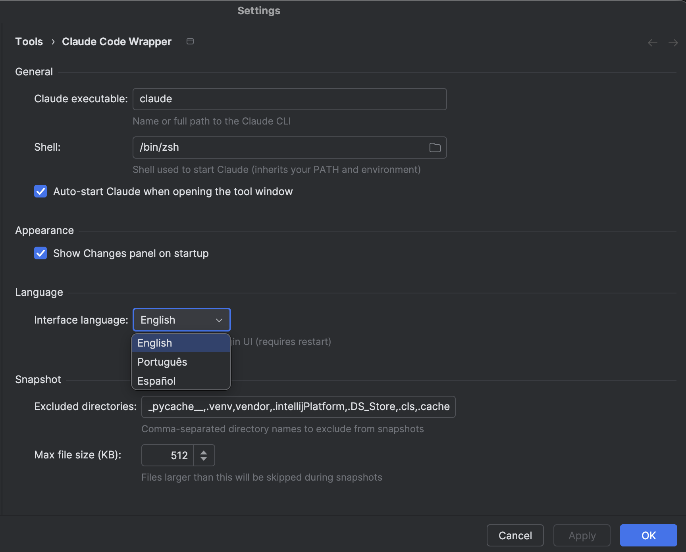
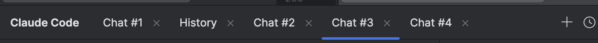

# Prism — IDE Companion for Claude Code

[](https://github.com/VGirotto/prism-claude-code-plugin/releases)
[](LICENSE)
[](https://plugins.jetbrains.com/)

> [Leia em Portugues](README.pt-BR.md)

A full-featured JetBrains plugin that integrates the **Claude Code CLI** directly into your IDE — with a graphical interface, per-interaction diff view, conversation history, and multi-session support.

Prism is a **local visual wrapper** — it spawns the Claude Code CLI via a real PTY and makes **no external API calls**. You must have the CLI installed and authenticated independently.

> **Disclaimer:** This is an unofficial community plugin, not affiliated with or endorsed by Anthropic, PBC. "Claude" and "Claude Code" are trademarks of Anthropic, PBC.

---

## Features

### Interactive Terminal
- Full Claude Code terminal running inside the IDE
- Complete ANSI color and text formatting support
- Real PTY (pty4j + JediTerm) for maximum compatibility

### Claude Changes Panel
- Automatic diff view of all files modified per interaction
- Native IDE side-by-side diff (original vs. modified)
- Revert per file or per entire interaction
- History navigation between interactions
- Auto-refresh when Claude finishes responding

### IDE Integration
- Context menu: **Explain** / **Review** / **Fix** / **Generate Tests** / **Refactor**
- Send selection directly to Claude
- File reference with `@path` in the terminal
- Auto-capture of context (active file, selection, open files)

### Productivity
- Compact toolbar with quick action buttons
- Dropdowns: Model (opus/sonnet/haiku), Effort (auto/low/medium/high/max)
- Reusable [Prompt Templates](docs/prompt-templates.md) with `{selection}`, `{file}`, `{language}` variables
- Customizable keyboard shortcuts

### History & Sessions
- Conversation history browser with full-text search
- Multi-session: multiple simultaneous sessions in independent tabs
- Status bar widget showing state (working/idle/stopped)
- i18n: English, Portuguese, Spanish

---

## Prerequisites

| Requirement | Version | Notes |
|-------------|---------|-------|
| **JetBrains IDE** | 2024.3+ | IntelliJ IDEA, GoLand, WebStorm, PyCharm, CLion |
| **Claude Code CLI** | 1.0+ | `npm install -g @anthropic-ai/claude-code` |
| **JDK** | 17+ | Only for development (IDE provides JBR) |

---

## Installation

### Option 1: Download from Releases (Recommended)

1. Download the latest version from [Releases](https://github.com/VGirotto/prism-claude-code-plugin/releases)
2. In the IDE: **Settings > Plugins > Gear icon > Install Plugin from Disk**
3. Select the downloaded `.zip` file
4. **Restart** the IDE
5. The "Claude Code" panel appears in the bottom bar

### Option 2: Build Locally

```bash
git clone https://github.com/VGirotto/prism-claude-code-plugin.git
cd prism-claude-code-plugin

# Set JAVA_HOME if you don't have a global JDK
export JAVA_HOME="/path/to/your/IDE.app/Contents/jbr/Contents/Home"

./gradlew buildPlugin

# Install: Settings > Plugins > Install Plugin from Disk
# Select: build/distributions/*.zip
```

---

## Usage

### Keyboard Shortcuts

| Shortcut | Action | Platform |
|----------|--------|----------|
| `Cmd+Shift+C` | Toggle Claude Code | macOS |
| `Alt+Shift+C` | Toggle Claude Code | Linux/Windows |
| `Ctrl+Shift+D` | Show Claude Changes (diff) | macOS |
| `Ctrl+Alt+Shift+D` | Show Claude Changes (diff) | Linux/Windows |
| `Ctrl+Shift+Enter` | Send selection to Claude | macOS |
| `Ctrl+Alt+Shift+Enter` | Send selection to Claude | Linux/Windows |
| `Ctrl+Shift+K` | Insert @file reference | macOS |
| `Ctrl+Alt+Shift+K` | Insert @file reference | Linux/Windows |

> On macOS, `Ctrl` refers to the physical Control key (not Cmd).

### Context Menu (Right-click in editor)

- **Send Selection to Claude** — send selected text
- **Ask Claude...** submenu:
  - Explain this code
  - Review this code
  - Fix this code
  - Generate Tests
  - Refactor this code

### Toolbar

| Button | Action |
|--------|--------|
| Resume | Resume last conversation |
| Compact | Compact session context |
| Model | Switch model (opus/sonnet/haiku) |
| Effort | Switch effort (auto/low/medium/high/max) |
| Cost | View cost estimate |
| Templates | Use/create prompt templates |

### Quick Access

- **IDE Menu**: `Tools > Toggle Claude Code`
- **Settings**: `Settings > Tools > Prism — Claude Code`
- **Status Bar**: Click the widget to open the Claude panel

---

## Screenshots

### Interactive Terminal



*Full terminal with Claude Code, toolbar (Model, Effort, Cost, Resume) and status bar widget.*

---

### Claude Changes Panel



*Native IDE side-by-side diff with file list, revert, and history navigation.*

---

### Context Menu



*Right-click in editor: Explain, Review, Fix, Generate Tests, Refactor.*

---

### Prompt Templates





*Reusable templates with {selection}, {file}, {language} variables.*

---

### Conversation History





*Browse past conversations with full-text search.*

---

### Settings



*Claude path, shell, language, exclusions, auto-start, and toggles.*

---

### Multi-Session



*Multiple simultaneous sessions in independent tabs.*

---

## Contributing

See [CONTRIBUTING.md](CONTRIBUTING.md) for development setup, build commands, and contribution workflow.

Found a bug or have an idea? Open an [Issue](https://github.com/VGirotto/prism-claude-code-plugin/issues).

---

## Documentation

- [Prompt Templates Guide](docs/prompt-templates.md)
- [Architecture & Project Structure](docs/architecture.md)

---

## License

Apache License 2.0 — see [LICENSE](LICENSE) for details.
