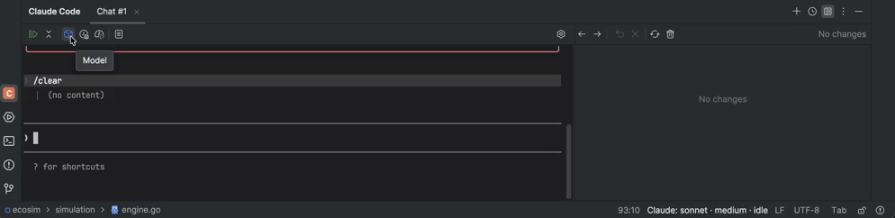
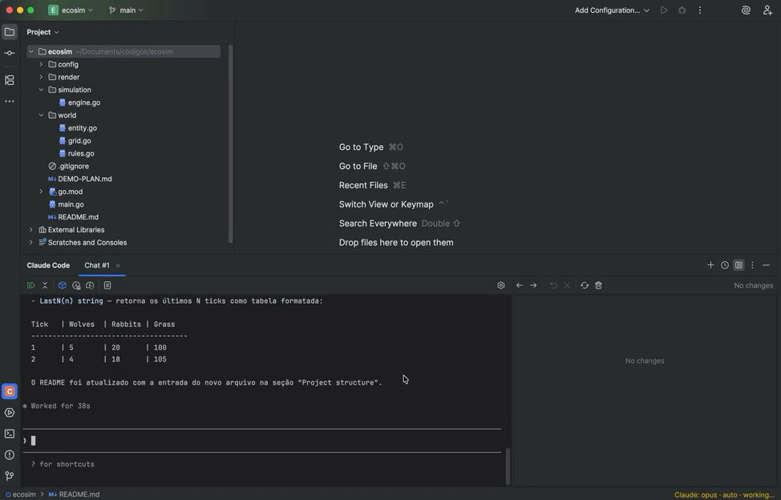
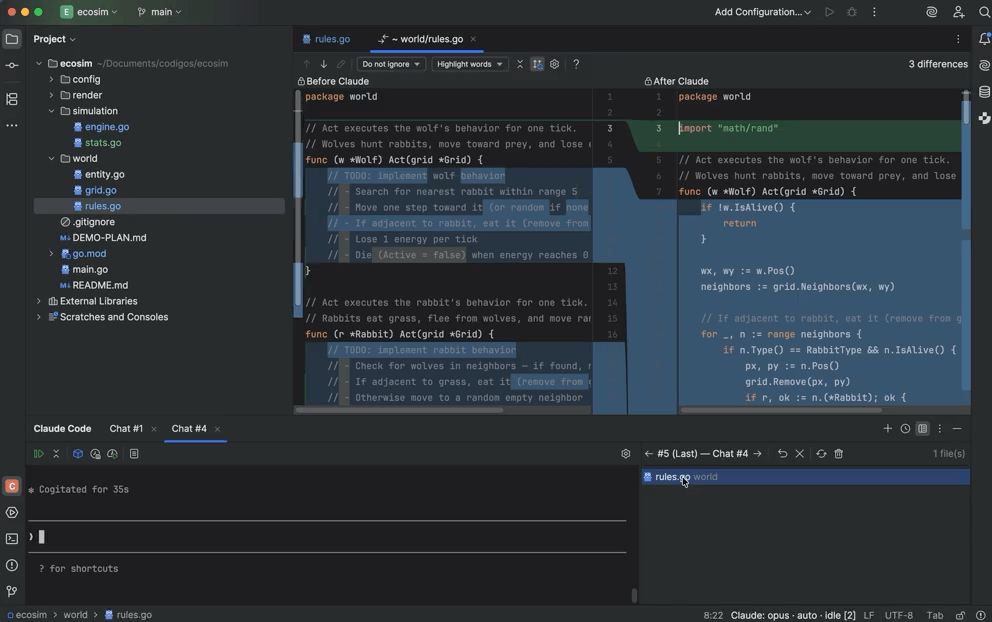
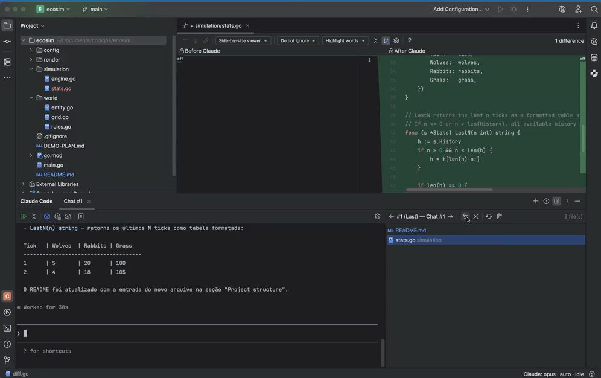
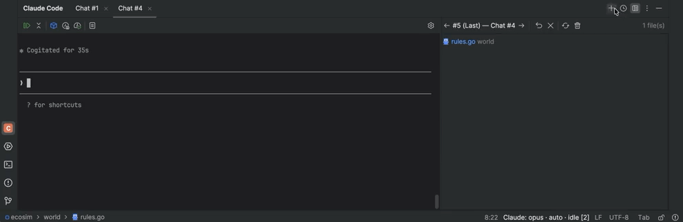

#  Prism — IDE Companion for Claude Code

[](https://github.com/VGirotto/prism-claude-code-plugin/releases)
[](LICENSE)
[](https://plugins.jetbrains.com/)

> [Leia em Português](README.pt-BR.md)

A full-featured JetBrains plugin that integrates the **Claude Code CLI** directly into your IDE — with a graphical interface, per-interaction diff view, conversation history, and multi-session support.

Prism is a **local visual wrapper** — it spawns the Claude Code CLI via a real PTY and makes **no external API calls**. You must have the CLI installed and authenticated independently.


> **Disclaimer:** This is an unofficial community plugin, not affiliated with or endorsed by Anthropic, PBC. "Claude" and "Claude Code" are trademarks of Anthropic, PBC.

---

## 🚀 Quick Install

> **3 steps to get started — no build required!**

### Prerequisites

| Requirement | Version | Notes |
|-------------|---------|-------|
| 🖥️ **JetBrains IDE** | 2024.3+ | IntelliJ IDEA, GoLand, WebStorm, PyCharm, CLion |
| 🤖 **Claude Code CLI** | 1.0+ | `npm install -g @anthropic-ai/claude-code` |

### Option 1: Download from Releases (Recommended) ⭐

1. 📦 Download the latest `.zip` from [**Releases**](https://github.com/VGirotto/prism-claude-code-plugin/releases)
2. ⚙️ In the IDE: **Settings → Plugins → ⚙️ Gear icon → Install Plugin from Disk**
3. 🔄 **Restart** the IDE — the "Claude Code" panel appears in the bottom bar

That's it! 🎉

### Option 2: Build Locally 🔧

<details>
<summary>Click to expand build instructions</summary>

```bash
git clone https://github.com/VGirotto/prism-claude-code-plugin.git
cd prism-claude-code-plugin

# Set JAVA_HOME if you don't have a global JDK (17+)
export JAVA_HOME="/path/to/your/IDE.app/Contents/jbr/Contents/Home"

./gradlew buildPlugin

# Install: Settings > Plugins > Install Plugin from Disk
# Select: build/distributions/*.zip
```

</details>

---

## 🎬 Features in Action

### 🖥️ Interactive Terminal

Full Claude Code terminal running inside the IDE with ANSI color support and real PTY (pty4j + JediTerm).

Compact toolbar with quick actions: **Model** (opus/sonnet/haiku), **Effort** (auto/low/medium/high/max), **Cost**, **Resume**, and more.



---

### 📝 Claude Changes Panel

Automatic diff view of all files modified per interaction — native IDE side-by-side diff with history navigation between interactions.



Navigate through interaction history:



Revert per file or per entire interaction with a single click:



---

### 🖱️ Context Menu & IDE Integration

Right-click in editor to access: **Explain** / **Review** / **Fix** / **Generate Tests** / **Refactor**.


- 📎 File reference with `@path` in the terminal
- 🎯 Auto-capture of context (active file, selection, open files)

---

### 📋 Prompt Templates & Multi-Session

Reusable [Prompt Templates](docs/prompt-templates.md) with `{selection}`, `{file}`, `{language}` variables. Run multiple simultaneous sessions in independent tabs.


---

### 🕐 Conversation History

Browse past conversations with full-text search. Resume any previous session.



---

### ⚙️ Settings

Configure Claude path, shell, language, exclusions, auto-start, and toggles.


---

## ⌨️ Keyboard Shortcuts

| Shortcut | Action | Platform |
|----------|--------|----------|
| `Cmd+Shift+C` | Toggle Claude Code | macOS |
| `Alt+Shift+C` | Toggle Claude Code | Linux/Windows |
| `Ctrl+Shift+D` | Show Claude Changes (diff) | macOS |
| `Ctrl+Alt+Shift+D` | Show Claude Changes (diff) | Linux/Windows |
| `Ctrl+Shift+Enter` | Send selection to Claude | macOS |
| `Ctrl+Alt+Shift+Enter` | Send selection to Claude | Linux/Windows |
| `Ctrl+Shift+K` | Insert @file reference | macOS |
| `Ctrl+Alt+Shift+K` | Insert @file reference | Linux/Windows |

> On macOS, `Ctrl` refers to the physical Control key (not Cmd).

### 🔗 Quick Access

- **IDE Menu**: `Tools > Toggle Claude Code`
- **Settings**: `Settings > Tools > Prism — Claude Code`
- **Status Bar**: Click the widget to open the Claude panel

---

## 🤝 Contributing

See [CONTRIBUTING.md](CONTRIBUTING.md) for development setup, build commands, and contribution workflow.

Found a bug or have an idea? Open an [Issue](https://github.com/VGirotto/prism-claude-code-plugin/issues) 🐛

---

## 📚 Documentation

- [Prompt Templates Guide](docs/prompt-templates.md)
- [Architecture & Project Structure](docs/architecture.md)

---

## 📄 License

Apache License 2.0 — see [LICENSE](LICENSE) for details.
