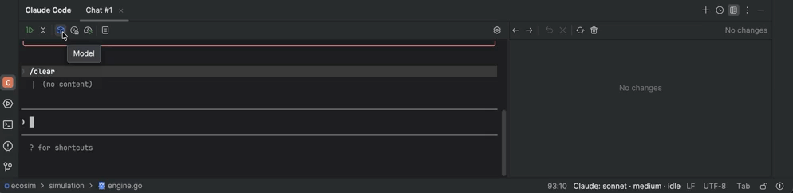
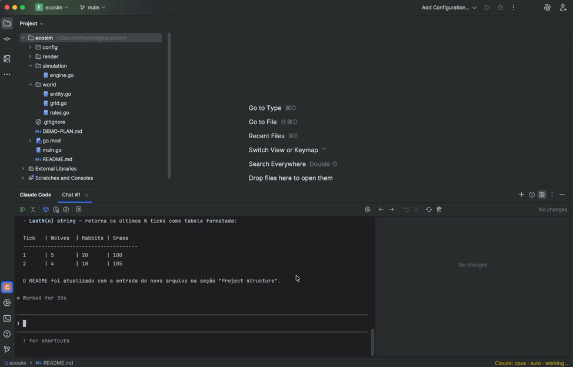
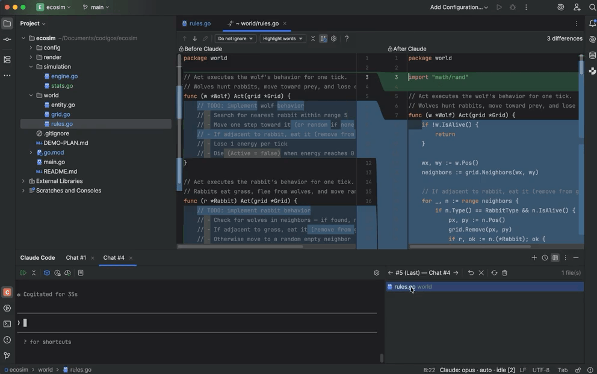
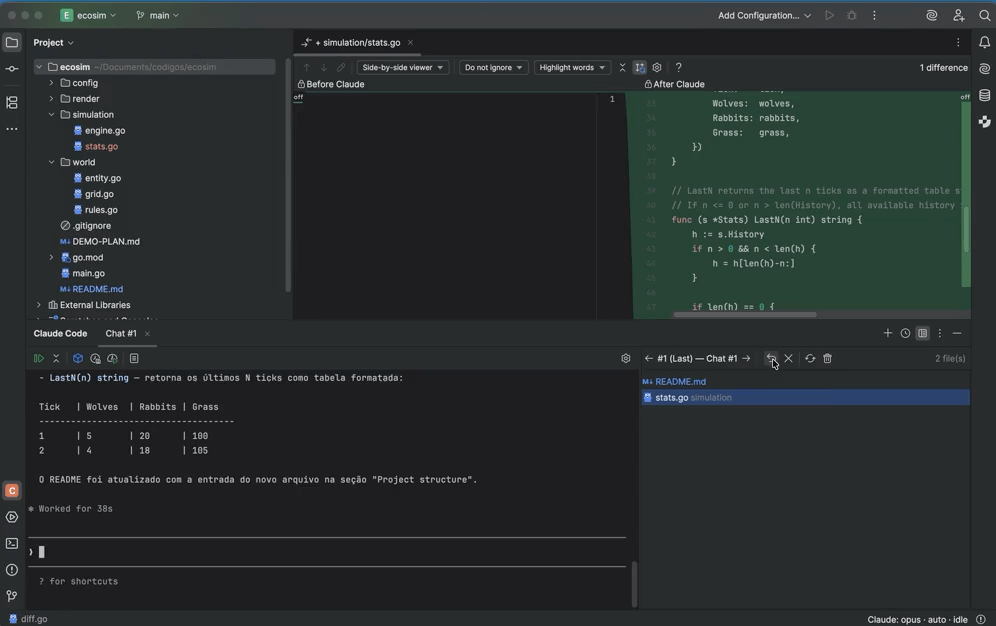
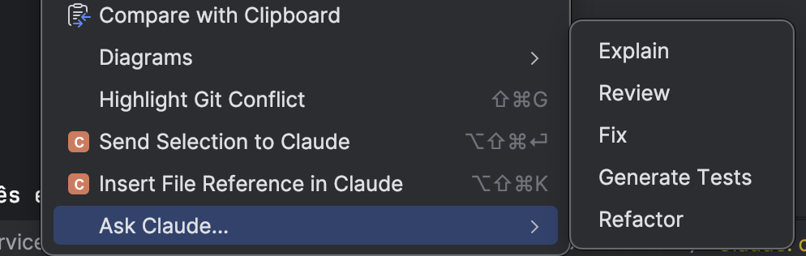
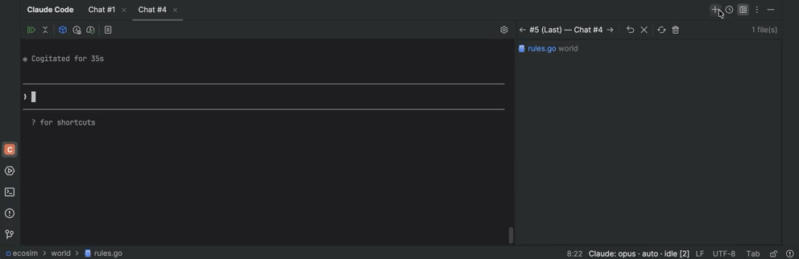
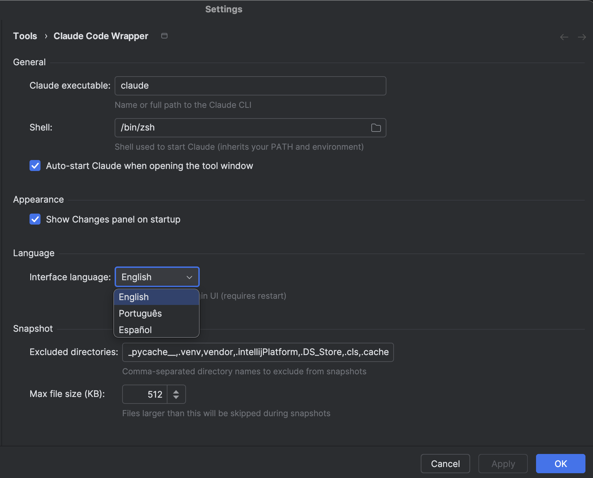

#  Prism — IDE Companion for Claude Code and Codex

[](https://github.com/VGirotto/prism-claude-code-plugin/releases)
[](LICENSE)
[](https://plugins.jetbrains.com/)

> [Read in English](README.md)

Plugin completo para JetBrains que integra o **Claude Code CLI** e o **OpenAI Codex CLI** diretamente na sua IDE — com interface gráfica, diff view por interação, histórico de conversas e suporte a múltiplas sessões.

Prism é um **wrapper visual local** — ele executa cada CLI via PTY real e **não faz chamadas externas**. Você precisa ter o(s) CLI(s) instalado(s) e autenticado(s) de forma independente.


> **Aviso:** Este é um plugin da comunidade, não afiliado ou endossado pela Anthropic, PBC ou OpenAI. "Claude" e "Claude Code" são marcas da Anthropic, PBC. "Codex" é marca da OpenAI.

---

## 🚀 Instalação Rápida

> **3 passos para começar — sem precisar compilar!**

### Pré-requisitos

| Requisito | Versão | Notas |
|-----------|--------|-------|
| 🖥️ **IDE JetBrains** | 2024.3+ | IntelliJ IDEA, GoLand, WebStorm, PyCharm, CLion |
| 🤖 **Claude Code CLI** | 1.0+ | `npm install -g @anthropic-ai/claude-code` (opcional, se você só usa Codex) |
| 🧠 **Codex CLI** | 0.10+ | `npm install -g @openai/codex` (opcional, se você só usa Claude) |

Pelo menos um dos CLIs é necessário. O botão "Nova Sessão" exibe um seletor quando ambos estão instalados.

### Opção 1: Download do Release (Recomendado) ⭐

1. 📦 Baixe o `.zip` mais recente em [**Releases**](https://github.com/VGirotto/prism-claude-code-plugin/releases)
2. ⚙️ Na IDE: **Settings → Plugins → ⚙️ Engrenagem → Install Plugin from Disk**
3. 🔄 **Reinicie** a IDE — o painel "Prism" aparece na barra inferior

Pronto! 🎉

### Opção 2: Compilar Localmente 🔧

<details>
<summary>Clique para expandir as instruções de build</summary>

```bash
git clone https://github.com/VGirotto/prism-claude-code-plugin.git
cd prism-claude-code-plugin

# Defina JAVA_HOME se não tiver JDK global (17+)
export JAVA_HOME="/caminho/para/sua/IDE.app/Contents/jbr/Contents/Home"

./gradlew buildPlugin

# Instalar: Settings > Plugins > Install Plugin from Disk
# Selecione: build/distributions/*.zip
```

</details>

---

## 🎬 Features em Ação

### 🖥️ Terminal Interativo

Terminal completo do agente rodando dentro da IDE com suporte a cores ANSI e PTY real (pty4j + JediTerm). Escolha Claude Code ou Codex ao iniciar uma nova sessão.

Toolbar compacta com ações rápidas: **Resume**, **Compact**, **Clear**, **Model**, **Effort**, **Cost**, **Templates** e **Settings**. Todos os botões funcionam tanto em sessões Claude Code quanto Codex, mapeados para os comandos de cada agente (por exemplo, **Cost** executa `/cost` no Claude e abre as visões de atividade de tokens do `/usage` no Codex).



---

### 📝 Painel de Mudanças do Agente

Diff view automático de todos os arquivos modificados por interação — diff side-by-side nativo da IDE com navegação entre interações. Funciona tanto para sessões Claude quanto Codex.



Navegue pelo histórico de interações:



Reverta por arquivo ou por interação completa com um clique:



---

### 🖱️ Menu de Contexto & Integração com a IDE

Clique direito no editor para acessar: **Explain** / **Review** / **Fix** / **Generate Tests** / **Refactor**.



- 📎 Referência de arquivo com `@path` no terminal
- 🎯 Auto-capture de contexto (arquivo ativo, seleção, arquivos abertos)

---

### 📋 Prompt Templates & Multi-Session

[Prompt Templates](docs/prompt-templates.md) reutilizáveis com variáveis `{selection}`, `{file}`, `{language}`. Execute múltiplas sessões simultâneas em tabs independentes.


---

### 🕐 Histórico de Conversas

Navegue por conversas anteriores com busca full-text. Retome qualquer sessão anterior. O histórico filtra pelo CLI da sessão ativa:

- Sessões **Claude** são lidas de `~/.claude/projects/<caminho-do-projeto-escapado>/*.jsonl`
- Sessões **Codex** são lidas de `~/.codex/sessions/AAAA/MM/DD/rollout-*.jsonl` e filtradas pelo `cwd` da sessão



---

### ⚙️ Configurações

Configure shell, **agente padrão**, **caminho do Claude**, **caminho do Codex**, idioma, exclusões, auto-start e toggles.
Exclusões de snapshot aceitam nomes ou padrões curinga separados por vírgula, por exemplo `node_modules`, `cmake-build-*` ou `**/generated`.



---

## ⌨️ Atalhos de Teclado

| Atalho | Ação | Plataforma |
|--------|------|------------|
| `Cmd+Shift+C` | Abrir/fechar Prism | macOS |
| `Alt+Shift+C` | Abrir/fechar Prism | Linux/Windows |
| `Ctrl+Shift+D` | Mostrar Mudanças do Agente (diff) | macOS |
| `Ctrl+Alt+Shift+D` | Mostrar Mudanças do Agente (diff) | Linux/Windows |
| `Ctrl+Shift+Enter` | Enviar seleção ao agente | macOS |
| `Ctrl+Alt+Shift+Enter` | Enviar seleção ao agente | Linux/Windows |
| `Ctrl+Shift+K` | Inserir referência @arquivo | macOS |
| `Ctrl+Alt+Shift+K` | Inserir referência @arquivo | Linux/Windows |

> No macOS, `Ctrl` = tecla Control física (não Cmd).

#### Colar no terminal do agente (Linux)

No Linux, `Ctrl+V` inspeciona a área de transferência: se contiver uma imagem, os bytes são gravados em um PNG temporário e o caminho do arquivo é colado no prompt (o agente anexa o arquivo). Caso contrário, o texto da área de transferência é colado (envolto em escapes de bracketed paste, então conteúdo de múltiplas linhas não é submetido automaticamente). Use `Ctrl+Shift+V` para forçar uma colagem de texto puro. No macOS e Windows, `Ctrl+V` mantém o comportamento nativo do CLI do agente.

### 🔗 Acessos Rápidos

- **Menu IDE**: `Tools > Toggle Prism`
- **Configurações**: `Settings > Tools > Prism`
- **Status Bar**: Clique no widget para abrir o painel do agente

---

## 🤝 Contribuindo

Veja [CONTRIBUTING.md](CONTRIBUTING.md) para setup de desenvolvimento, comandos de build e workflow de contribuição.

Encontrou um bug ou tem uma ideia? Abra uma [Issue](https://github.com/VGirotto/prism-claude-code-plugin/issues) 🐛

---

## 📚 Documentação

- [Guia de Prompt Templates](docs/prompt-templates.md)
- [Arquitetura & Estrutura do Projeto](docs/architecture.md)

---

## 📄 Licença

Apache License 2.0 — veja [LICENSE](LICENSE) para detalhes.
