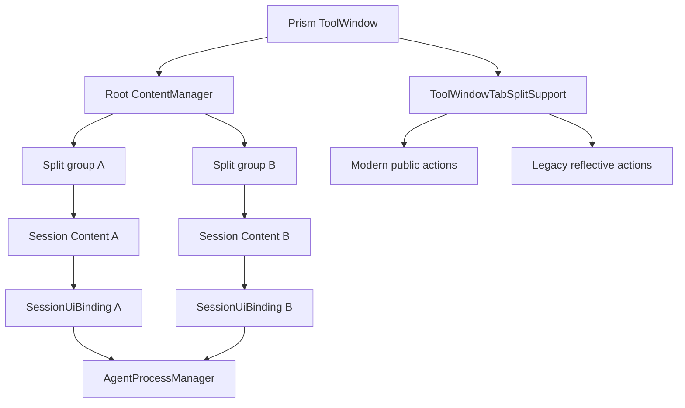
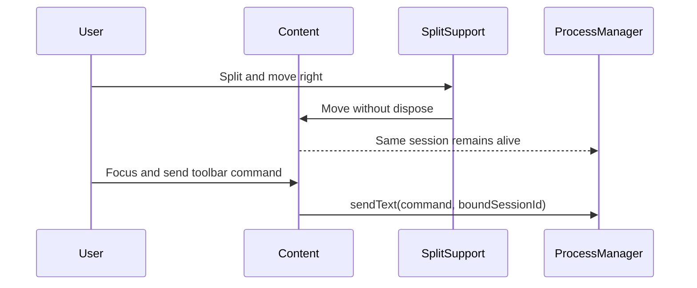

# Tool Window Tab Splitting Architecture

```mermaid
graph TB
    TW[Prism ToolWindow] --> CM[Root ContentManager]
    CM --> SA[Split group A]
    CM --> SB[Split group B]
    SA --> CA[Session Content A]
    SB --> CB[Session Content B]
    CA --> BA[SessionUiBinding A]
    CB --> BB[SessionUiBinding B]
    BA --> PM[AgentProcessManager]
    BB --> PM
    TW --> CS[ToolWindowTabSplitSupport]
    CS --> MA[Modern public actions]
    CS --> LA[Legacy reflective actions]
```

```mermaid
sequenceDiagram
    participant User
    participant Content
    participant SplitSupport
    participant ProcessManager
    User->>SplitSupport: Split and move right
    SplitSupport->>Content: Move without dispose
    Content-->>ProcessManager: Same session remains alive
    User->>Content: Focus and send toolbar command
    Content->>ProcessManager: sendText(command, boundSessionId)
```
