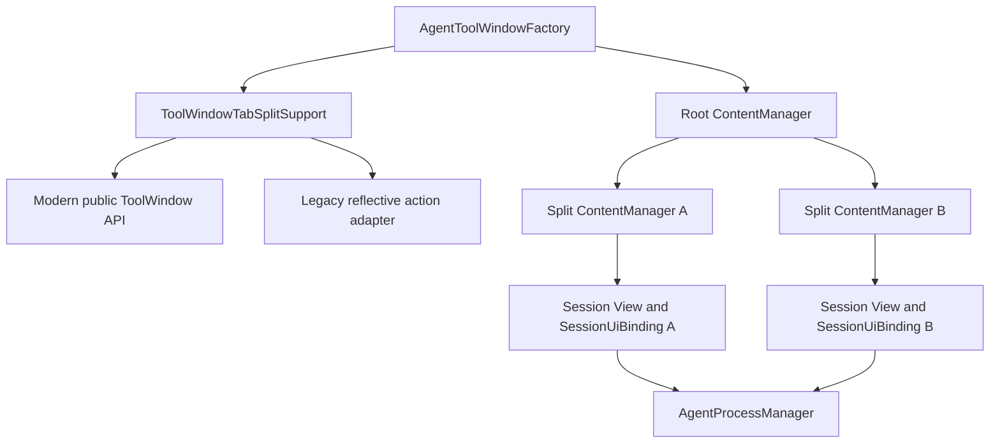
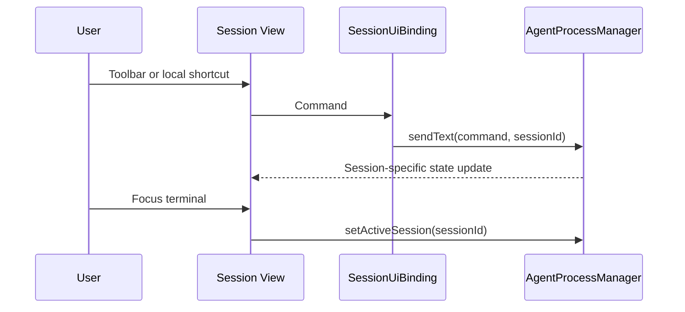
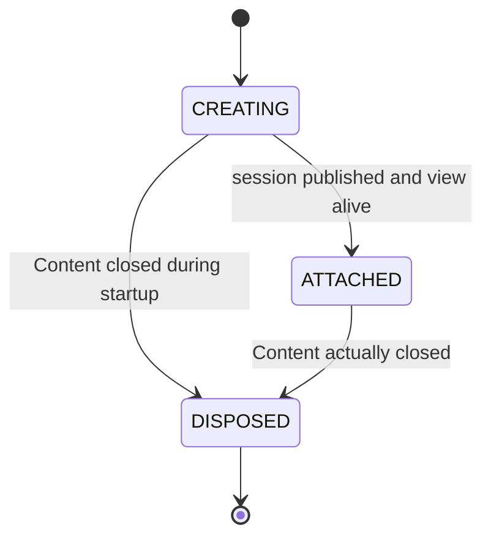

# Tool Window Tab Splitting - Technical Spec

**Status**: approved
**Owner**: VGirotto
**Created**: 2026-09-04
**Last Updated**: 2026-09-04
**Based on**: `../1-functional/spec.md`

## Executive Summary

Prism will use JetBrains' native ToolWindow Content splitting rather than own a
parallel tab implementation. A capability adapter probes the runtime: modern
IDEs enable the public ToolWindow splitting API and registered `TW.*` actions;
build 243-era IDEs use the legacy experimental split actions through narrowly
scoped reflection. Failure to resolve either strategy disables only splitting.

Session UI will gain an explicit binding. Panel-local actions use the bound ID,
while `AgentProcessManager.activeSessionId` remains the last-focused global
target for actions originating in the editor or project tree.

## Architecture Overview

### Command Routing

## Components

### ToolWindowTabSplitSupport

- Own capability detection, native action resolution, split execution, and unsplit.
- Probe API presence rather than hardcode an upper version boundary.
- Modern strategy invokes `setTabsSplittingAllowed(true)` and uses the current
  `TW.SplitAndMoveRight`, `TW.SplitAndMoveDown`, and `TW.Unsplit` actions.
- Legacy strategy resolves fixed `TabbedContentAction` split/unsplit classes
  reflectively, avoiding static references that would break newer IDEs.
- All reflective failures are caught and logged once; the adapter returns unavailable.

### SessionUiBinding

- Stores the immutable CLI and a thread-visible session ID assigned after startup.
- Resolves the bound `AgentSession` for action presentation and sequence gating.
- Sends text/sequences and updates effort/model through ID-specific manager methods.
- Tracks `CREATING`, `ATTACHED`, and `DISPOSED` to coordinate asynchronous startup.

### AgentToolWindowFactory

- Enables split support when the ToolWindow is created.
- Enumerates `contentManager.getContentsRecursively()` for global operations.
- Resolves focused Content/ContentManager before opening asynchronous UI.
- Installs focus activation on each terminal view.
- Creates normal sessions in the focused manager and split sessions through a
  post-create callback that invokes the selected split direction.
- Retains `content.setDisposer` as the only session teardown owner.

### AgentToolbar and AgentProcessManager

- `AgentToolbar` receives `SessionUiBinding`; it no longer reads active session
  for panel-local actions.
- `AgentProcessManager` keeps active-only convenience methods for global actions
  and adds ID-specific state update methods.
- Destroying the active session clears it unless UI focus explicitly activates
  a surviving session; it does not select an arbitrary map entry.

## Fury Platform Compliance

Not applicable. Prism is an open-source local JetBrains plugin, has no `.fury`
application, Docker runtime, HTTP health endpoint, scope, or Fury service.

| Validator requirement | Status | Rationale |
|---|---|---|
| Dockerfile | Not applicable | Desktop IDE plugin distributed as ZIP/JAR |
| Dockerfile.runtime | Not applicable | Runs inside the JetBrains IDE runtime |
| `/ping` health check endpoint | Not applicable | No HTTP server or Fury deployment |

**Technology stack**: Kotlin/JVM, Gradle, IntelliJ Platform SDK, Swing, and the
bundled JetBrains Terminal plugin.

## Fury Services Used

None.

## Data Model

No persistent entities or database schema are introduced. Runtime state consists
only of existing `Content`, `AgentSession`, terminal, and binding object references.

## REST API Contracts

None. The feature adds local Swing/IntelliJ actions and does not expose or consume
an HTTP endpoint.

## Design Decisions

### DD-1: Native Content split with version adapter

**Options Considered**:
- Native version-adaptive Content split: exact IDE behavior, preserves Content identity.
- Custom nested JBSplitter/tab system: public baseline APIs but duplicates native tab behavior.
- Raise minimum build to 262: simplest API use but violates compatibility.

**Decision**: Native version-adaptive Content split.
**Rationale**: It best matches GoLand and the current disposer lifecycle while
preserving build 243 support.
**Trade-off**: The legacy strategy is reflective and requires runtime sandbox coverage.

### DD-2: Move rather than clone live sessions

**Decision**: A split moves a Content; only New Session in Split creates another process.
**Rationale**: Swing components have one parent and a PTY must have one terminal owner.

### DD-3: Bound local target plus last-focused global target

**Decision**: Panel actions use `SessionUiBinding`; editor actions keep using
`activeSessionId`, updated on focus.
**Rationale**: Two split groups each have a selected tab, so selection alone is ambiguous.

### DD-4: No layout persistence in 1.4.0

**Decision**: Let runtime layout live for the IDE session only.
**Rationale**: Persisting a platform-owned nested manager tree would add risk unrelated
to the primary simultaneous-session outcome.

## Detailed Behavior

### Focus and manager resolution

1. Prefer the Content whose component contains the current focus owner.
2. Fall back to Content matching `activeSessionId`.
3. Fall back to the root selected Content/manager.
4. Capture the manager before CLI discovery opens a popup; revalidate it on EDT.
5. If the captured manager is disposed or detached, use the root manager.

### Lifecycle state

- Publishing the ID and disposing the binding use the same synchronized transition.
- The EDT terminal attach runs only when state remains `ATTACHED`.
- Temporary Content removal during split does not dispose the Content or binding.

## Compatibility Contract

| Runtime | Strategy | Failure behavior |
|---|---|---|
| Build 262+ capability present | Public ToolWindow enable method plus current `TW.*` actions | Hide split actions if action lookup fails |
| Build 243/251 legacy classes present | Reflective legacy split/unsplit actions | Log and remain single-pane |
| Unknown future layout | Capability probe chooses available strategy | Prism sessions continue without splitting |

No direct reference to a class absent from either supported end of the version
range may appear in generally loaded bytecode.

## Implementation Locations

| Component | Files |
|---|---|
| Compatibility adapter and actions | `toolwindow/ToolWindowTabSplitSupport.kt`, `toolwindow/SessionSplitActions.kt` |
| Session binding and lifecycle | `toolwindow/SessionUiBinding.kt` |
| Content creation and focus | `toolwindow/AgentToolWindowFactory.kt`, `toolwindow/NewSessionPopupAction.kt` |
| Bound toolbar commands | `toolwindow/AgentToolbar.kt` |
| ID-specific state updates | `services/AgentProcessManager.kt` |
| UI strings and action registration | message bundles and `META-INF/plugin.xml` as required |
| Release metadata | `gradle.properties`, both READMEs, `CHANGELOG.md`, `META-INF/plugin.xml` |

## Testing Strategy

**Coverage Target**: At least 80% of new pure routing, capability, and lifecycle logic.

### Unit Tests

- Capability selection and fixed reflection targets.
- Binding routes commands to its own session when another session is globally active.
- Sequence gating is isolated per binding.
- Lifecycle transitions reject attach after disposal and destroy once.
- Focus/content resolver handles recursive managers and safe root fallback.

### Integration Tests

- Compile the complete plugin against the build 243 baseline.
- Verify action lookup and Content movement in IntelliJ Platform fixtures where feasible.
- Validate all existing terminal, toolbar, and session tests remain green.

### E2E Tests

Run the local IDE sandbox matrix below; LTP is disabled because no Fury application exists.

| Scenario | IC 2024.3 | GoLand 2026.2.1 |
|---|---:|---:|
| Split/move right and down | Required | Required |
| Unsplit and tab reorder | Required | Required |
| Correct toolbar/shortcut target | Required | Required |
| Close one/close all/startup close | Required | Required |
| New Session in Split | Required | Required |

### Build validation

- `./gradlew test --offline --no-daemon`
- `./gradlew buildPlugin --offline --no-daemon`
- `./gradlew verifyPlugin`
- `git diff --check`

## Security

- No secrets, authentication, network, file-system, or shell changes.
- Reflection uses constants owned by the plugin and never user-controlled names.
- Session-bound routing prevents cross-agent command injection through focus races.

## Performance

- Existing sessions are moved without process or terminal recreation.
- Capability reflection is resolved once per ToolWindow initialization and cached.
- Recursive Content enumeration is bounded by the small number of user-created tabs.
- A split action should complete its synchronous layout work within 100 ms on the EDT,
  excluding the independent asynchronous startup of a newly requested session.

## Deployment Strategy

Distribution remains the existing JetBrains plugin ZIP and GitHub tag workflow.
This implementation does not deploy or publish automatically. Rollback is installation
of Prism 1.3.1 or disabling split actions when runtime capability resolution fails.

## Release

- Target version: `1.4.0`.
- Update all version surfaces required by `.agents/development-workflow.md`.
- Do not publish or create a GitHub release as part of implementation.

## Open Questions

None blocking. Layout restoration remains a future feature.
